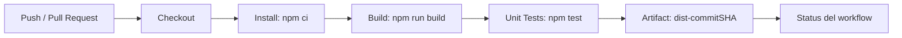

# Sesión 04 — CI/CD y Arquitectura del Pipeline DevSecOps

**Proyecto:** SecurePipeline — SecureBank API  
**Entregable:** Pipeline CI v1.0  
**Repositorio:** `securebank-api`

Esta carpeta documenta el trabajo de la Sesión 04 y mantiene la continuidad con las sesiones anteriores:

- **Sesión 01:** ciclo DevSecOps y distribución de responsabilidades.
- **Sesión 02:** repositorio seguro, PR obligatorio, CODEOWNERS y política `Docs/POL-REPO-001.md`.
- **Sesión 03:** DFD, Threat Model STRIDE y security stories en `Docs/Threat_Modeling/`.
- **Sesión 04:** automatización CI de checkout → install → build → test → artifact.

## Participantes y categorías

| Integrante | Categoría principal | Responsabilidad aplicada en Sesión 04 |
|---|---|---|
| **Matías Sepúlveda** | **Arquitectura y Planificación (Plan)** | Modelar el flujo del pipeline, dependencias entre etapas y criterios de aceptación. |
| **Vicente Cosio** | **Desarrollo y Calidad (Code / Build)** | Mantener build reproducible, lockfile, estructura de código y pruebas unitarias. |
| **Marcela Manzor** | **Pruebas y Aprobación (Test / Release)** | Validar ejecución de tests, resultado del workflow, artefacto y condición previa al merge. |
| **Catalina Garrido** | **Despliegue y Operaciones (Deploy / Operate / Monitor)** | Revisar trazabilidad, artefactos y futura preparación de despliegue/monitoreo. |
| **Franco Pérez (@DonnyA32)** | **Seguridad del Pipeline (Security Test / CI Security)** | Revisar permisos del workflow, detectar configuraciones inseguras, comprobar dependencias fijadas y preparar la incorporación de SAST en la Sesión 05. |

La asignación indica el foco principal de cada integrante; la seguridad sigue siendo responsabilidad compartida.

## Trabajo asignado a Franco Pérez

Franco queda encargado de la **revisión de seguridad del pipeline CI v1.0**. Su trabajo consiste en:

1. Revisar que el workflow utilice permisos mínimos (`contents: read`).
2. Verificar que no existan secretos escritos directamente en el YAML.
3. Comprobar que las dependencias sean reproducibles mediante `package-lock.json` y `npm ci`.
4. Revisar los cuatro riesgos R1–R4 del ejercicio de pipeline inseguro.
5. Preparar la propuesta del futuro step/job `security-test` para integrar SAST en la Sesión 05.

## Arquitectura del pipeline v1.0

Cada etapa funciona como una puerta de calidad: si una falla, las etapas siguientes no continúan.

## Elementos utilizados

| Elemento | Implementación |
|---|---|
| **Workflow** | `.github/workflows/ci.yml` |
| **Trigger** | Push a `main` y `feature/**`; Pull Request hacia `main` |
| **Runner** | `ubuntu-latest` |
| **Job** | `build-test` |
| **Steps** | Checkout, Setup Node, Install, Build, Unit tests, Upload artifact |
| **Artifact** | `dist-${{ github.sha }}` |
| **Retención** | 7 días |
| **Permisos** | `contents: read` por mínimo privilegio |

## Definition of Done

- [x] Workflow versionado en `.github/workflows/ci.yml`.
- [x] Dependencias reproducibles mediante `package-lock.json` + `npm ci`.
- [x] Build genera la carpeta `dist/`.
- [x] Pruebas unitarias incluidas.
- [x] Artefacto versionado con hash de commit y retención de 7 días.
- [x] No hay secretos hard-codeados en el YAML.
- [x] Workflow preparado para reportar estado en cada PR a `main`.
- [ ] Configurar en GitHub la regla que hace **obligatorio** el status check `build-test` antes del merge.

> El último punto depende de la configuración administrativa de protección de rama/rulesets en GitHub y no se define dentro del archivo YAML.

## Relación con la Sesión 05

La próxima capa será **SAST**. Franco Pérez queda como responsable principal de preparar la revisión de seguridad necesaria para incorporar posteriormente el job o step `security-test`, con apoyo del resto del equipo.
