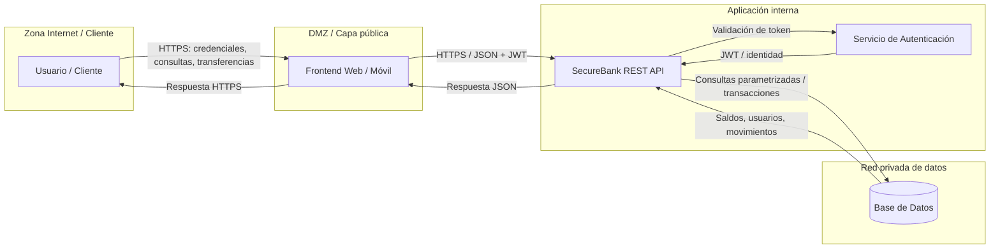

# DFD — SecureBank API

## Objetivo

Representar el flujo de información de SecureBank y marcar las tres fronteras de confianza exigidas para el laboratorio de Threat Modeling.

## Diagrama

## Fronteras de confianza

| Trust Boundary | Cruce | Controles obligatorios |
|---|---|---|
| **TB1** | Internet ↔ Frontend | TLS/HTTPS, validación de entrada, protección de sesión, rate limiting y controles anti-automatización. |
| **TB2** | DMZ / Frontend ↔ API | Autenticación mediante JWT firmado, autorización por operación y recurso, validación de esquema y registro de solicitudes relevantes. |
| **TB3** | API ↔ Red privada / Base de datos | Acceso restringido por red/rol, consultas parametrizadas, principio de mínimo privilegio, cifrado y auditoría. |

## Flujos críticos

1. **Login / sesión:** credenciales → Frontend → API/Auth → emisión de JWT.
2. **Consulta de cuentas:** JWT + identificador de cuenta → API → BD → respuesta de saldo/movimientos.
3. **Transferencia:** JWT + `originAccount` + `targetAccount` + `amount` → API → validación de propiedad → BD.
4. **Usuarios:** registro/perfil → API → BD.
5. **Movimientos:** solicitud autenticada → API → BD → historial.

## Regla aplicada

Cada vez que los datos atraviesan una frontera de confianza, SecureBank debe **validar la entrada, autenticar el origen y autorizar la acción**. Para operaciones sensibles, además debe dejar trazabilidad suficiente para no repudio y monitoreo.

## Responsabilidad principal

**Arquitectura y Planificación (Plan): Matías Sepúlveda.**  
**Revisión de seguridad: Franco Pérez (@DonnyA32) — Security Test / CI Security.**  
Revisión cruzada: todo el equipo bajo el principio de responsabilidad compartida.
